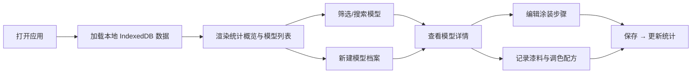

## 1. 产品概述

高达模型涂装进度册 - 为模型涂装爱好者量身打造的个人涂装进度追踪工具。记录每台模型的比例、系列、涂装阶段、使用漆料品牌与调色配方，通过多维度筛选快速定位半成品与完成品，解决"时间一长全忘干净"的痛点。

- 目标用户：高达模型 / 军模 / 手办涂装爱好者，有素组、喷涂、旧化等多阶段制作习惯
- 核心价值：让每台模型的涂装进度可视化、漆料用量可追溯、半成品一目了然

## 2. 核心功能

### 2.1 用户角色

无需注册登录，纯本地单用户使用。

### 2.2 功能模块

1. **模型总览页（首页）：统计概览、筛选栏、模型卡片列表
2. **模型详情页**：模型档案、涂装步骤时间线、漆料清单、调色配方
3. **新建/编辑模型**：档案表单（比例、系列、名称、备注）、步骤编辑、漆料记录
4. **进度统计仪表盘**：完成度分布、系列占比、涂装阶段进度条、月度完成趋势

### 2.3 页面详情

| 页面名称 | 模块名称 | 功能描述 |
|-----------|-------------|---------------------|
| 总览页 | 统计概览卡 | 显示总模型数、完成数、进行中、待开始、完成率环图 |
| 总览页 | 筛选过滤栏 | 按系列筛选、按涂装阶段筛选、按完成度区间筛选、搜索名称 |
| 总览页 | 模型卡片网格 | 展示模型缩略图、名称、系列、比例、进度条、当前阶段、下一步建议 |
| 模型详情页 | 档案信息卡 | 名称、比例、系列、购入日期、开始日期、完成日期、备注 |
| 模型详情页 | 涂装步骤时间线 | 按顺序展示各阶段（素组/水补/底漆/分色/旧化/完工），每步可标记时间、状态、照片 |
| 模型详情页 | 漆料与配方 | 关联每步使用的漆料（品牌+色号）、自定义调色配方（比例记录） |
| 新建/编辑模型 | 表单编辑 | CRUD 模型基本档案，增删改涂装步骤和漆料记录 |
| 统计仪表盘 | 数据可视化 | 完成度分布饼图、系列占比条形图、各阶段进度汇总、时间线甘特 |

## 3. 核心流程

用户打开应用 → 查看统计概览 → 浏览模型列表 → 通过筛选找到目标模型 → 点击查看详情 → 查看/编辑涂装步骤 → 记录漆料和配方 → 返回总览查看统计更新。

## 4. 用户界面设计

### 4.1 设计风格

- **主色**：深炭灰 `#1e1e24`（背景），机甲蓝 `#4f8cff`（主强调），警示橙 `#ff8c42`（进度强调）
- **配色逻辑**：暗色工业风，模拟模型工作台 + 工具箱氛围，避免纯白刺眼，长时间录入舒适
- **按钮样式**：方角微圆（4px），轻微内阴影模拟按钮凹槽感，hover 上浮 + 发光
- **字体**：标题用 `Space Grotesk`（机甲工业感），正文 `JetBrains Mono`（技术感、数字对齐）
- **布局风格**：卡片式网格，左侧固定筛选栏 + 右侧内容区，工作台分区明确
- **图标**：`lucide-react` 线性图标，搭配少量 emoji 点缀阶段标签
- **视觉细节**：卡片边框 1px 金属渐变描边，进度条带颗粒纹理，hover 微发光

### 4.2 页面设计概览

| 页面名称 | 模块名称 | UI 元素 |
|-----------|-------------|-------------|
| 总览页 | 统计概览 | 四色统计卡（完成/进行中/待开始/总数），圆环完成率，霓虹发光边框 |
| 总览页 | 筛选栏 | 胶囊式分段控件，阶段标签色带，搜索输入框左侧图标 |
| 总览页 | 卡片网格 | 卡片悬浮投影，进度条渐变填充，系列标签右上角徽章 |
| 详情页 | 时间线 | 左侧竖线连接节点，节点状态色区分，步骤完成打勾动画 |
| 详情页 | 漆料列表 | 色号色块 + 品牌标签，配方比例分数显示（3:1 等） |
| 详情页 | 表单编辑 | 模态框，分步骤 Tab，表单控件深色输入框，保存按钮发光 |
| 统计页 | 图表区 | SVG 自绘饼图/条形图，动画加载渐变填充，数值标签 |

### 4.3 响应式

桌面端优先（≥1280px，平板自适应，移动端 1 列堆叠，触摸目标 ≥44px。
