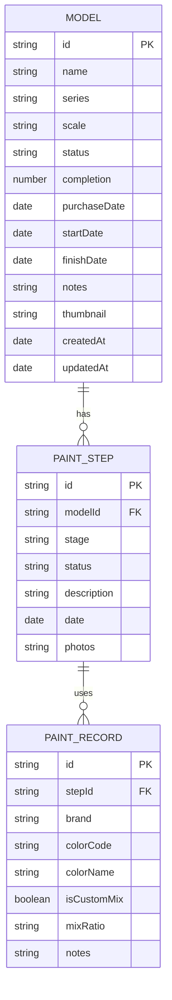

## 1. 架构设计

```mermaid
graph TD
    A["React 视图层 (src/pages, src/components"]
    B["Zustand Store 层 (src/stores)"]
    C["IndexedDB 数据访问层 (src/db)"]
    D["业务逻辑层 (src/services)"]

    A -->|订阅状态| B
    B -->|CRUD 操作| C
    A -->|调用业务方法| D
    D -->|封装数据操作| C

    A1["模型档案模块
    B1["modelStore
    C1["models 对象仓
    D1["ModelService"]

    A2["涂装步骤模块
    B2["paintStore
    C2["paintSteps 对象仓
    D2["PaintStepService"]

    A3["进度统计模块
    B3["statsStore
    C3["stats 计算层
    D3["StatsService"]

    A1 & A2 & A3 --> B1 & B2 & B3
    B1 --> C1
    B2 --> C2
    C1 & C2 --> D3
```

## 2. 技术描述

- 前端：React@18 + TypeScript + Vite@5
- 状态管理：Zustand@4
- 路由：React Router DOM@6
- 样式：TailwindCSS@3
- 本地数据库：IndexedDB（通过 idb 库封装
- 图标：lucide-react
- 纯前端无服务端，数据完全本地持久化到浏览器 IndexedDB

## 3. 目录结构：

```
src/
├── db/                    # IndexedDB 数据访问层（独立）
│   ├── index.ts          # DB 初始化、连接
│   ├── models.ts         # 模型表操作
│   └── paintSteps.ts     # 涂装步骤表操作
├── stores/                # Zustand 状态管理层（独立）
│   ├── modelStore.ts     # 模型档案状态
│   ├── paintStore.ts   # 涂装步骤状态
│   └── statsStore.ts   # 统计状态
├── services/              # 业务逻辑层（独立）
│   ├── ModelService.ts
│   ├── PaintStepService.ts
│   └── StatsService.ts
├── pages/               # 页面组件
│   ├── Overview.tsx     # 总览页
│   ├── ModelDetail.tsx
│   ├── ModelEditor.tsx
│   └── Dashboard.tsx
├── components/         # UI 组件
│   ├── model/         # 模型相关组件
│   ├── paint/        # 涂装相关组件
│   ├── stats/        # 统计组件
│   └── common/       # 通用组件
├── types/              # TypeScript 类型定义
│   └── index.ts
├── utils/              # 工具函数、示例数据
│   └── sampleData.ts
├── App.tsx
├── main.tsx
└── index.css
```

## 3. 路由定义

| 路由 | 用途 |
|-------|---------|
| / | 总览页（首页） |
| /model/:id | 模型详情页 |
| /model/new | 新建模型 |
| /model/:id/edit | 编辑模型 |
| /dashboard | 统计仪表盘 |

## 4. 数据模型

### 6.1 ER 图



### 6.2 阶段枚举

```typescript
// 涂装阶段枚举（按顺序）
type PaintStage = 'assembly'  // 素组组装
  | 'sanding'   // 打磨补土
  | 'primer'    // 水补/底漆
  | 'basecoat'  // 主色分色
  | 'detail'    // 细节补色
  | 'weathering' // 旧化渍洗
  | 'decals'   // 水贴
  | 'topcoat'  // 消光/光油
  | 'finished' // 完成收工
```
